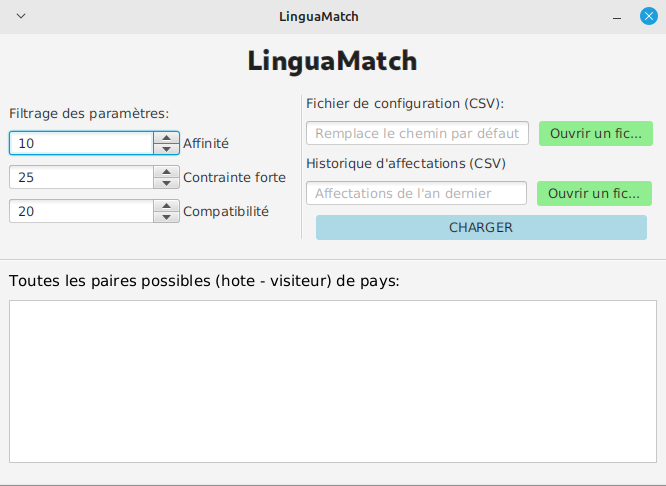

# LinguaMatch

par **WASSON Baptiste, LAGACHE Kylian, AOULAD-TAYAB Karim**

LinguaMatch est une application (avec et sans interface graphique) permettant d'automatiser le processus d'appariement entre adolescents hôtes/visiteur dans le cadre de séjours linguistiques...



**Avec LinguaMatch vous pourrez :**
- Importer un fichier CSV avec un format bien précis contentant les informations et les critères des adolescents et gérer les éventuelles incohérences (type, valeur)
- Trouver une solution sur les meilleurs appariements possibles pour tous les adolescents (si possible) via un algorithme d'affectation
- Afficher la solution via une interface graphique qui permettra également de modifier les paramètres de l'algorithme pour guider la solution mais aussi d'exporter la solution au format CSV
- Prendre en compte un historique des séjours des années précédentes pour une meilleure affectation des hôtes-visiteurs (cet historique est traité par sérialisation binaire)
- Des logs basiques rapportant les erreurs dans la console (pour l'interface graphique) lors de l'importation d'un fichier CSV

**Liens vers tous les rapports:**
- [Rapport POO](#)
- [Rapport Graphes](graphes/rapport.md)
- [Rapport IHM](Rapport-IHM.md)

### Releases

Pré-requis:

> On peut avoir une version supérieure à 17 par rapport à la version des fichiers compilés dans le JAR de ``linguamatch-gui.jar`` pour bénéficier de la rétro-compatibilité, mais pas en dessous de 17 (``linguamatch-console.jar`` est compilé à la version 11 de Java, donc pour faire fonctionner ces 2 fichiers JAR veuillez installer une version de Java égale 17 au minimum)

- Java (>= 17)

> Le SDK JavaFX n'est pas compatible pour tous les OS, il y a un SDK par plateforme donc il faut télécharger un SDK (de version 17 avec la bonne architecture et le bon OS)

- JavaFX SDK (= 17) [ [lien de téléchargement](https://gluonhq.com/products/javafx/) ]


> Ces fichiers JAR dépendent d'autres fichiers JAR, il faut donc (suivant le [MANIFEST](META-INF/MANIFEST.MF)) le lancer depuis la racine du projet

**Version console** : Cette version montre un rapide aperçu du fonctionnement du logiciel et ne fait que le strict minimum (importation / exportation CSV ou sérialisation et calcul d'affectation)

```
java -jar linguamatch-console.jar
```

**Version graphique** : Cette version est la plus complète et fournit une interface graphique plus conviviale pour l'utilisateur

```
java --module-path [CHEMIN_ABSOLU_VERS_LE_DOSSIER_LIB_DE_JAVAFX] --add-modules javafx.controls,javafx.fxml -jar linguamatch-gui.jar
```

### Configurer le projet

Si vous voulez manipuler le logiciel depuis le code source (pour lancer les tests par exemple), vous devez suivre à la lettre ce qui est indiqué en-dessous...

Il faut tout d'abord installer l'extension suivante ([ici](https://marketplace.visualstudio.com/items?itemName=vscjava.vscode-java-pack)) pour avoir tous les outils nécessaires à la compilation, éxecution du projet Java.

Ensuite vous devez configurer le buildpath car ce n'est pas le même chemin selon chaque utilisateur

> **IMPORTANT** : Ici le ``/`` est utilisé mais veuillez remplacer le ``/`` par ``\\`` si vous êtes sur Windows

Dans [.vscode/settings.json](.vscode/settings.json):

```json
"java.project.referencedLibraries": [
    "CHEMIN_ABSOLU_VERS_LE_DOSSIER_LIB_DE_JAVAFX/*.jar",
    "lib/*.jar"
]
```

Dans le fichier global 'settings.json' de VSCode:

> Chemin de ce fichier:
> - (Linux) ~/.config/Code/User/settings.json
> - (MacOS) $HOME/Library/Application\ Support/Code/User/settings.json
> - (Windows) %APPDATA%\Code\User\settings.json

Ajoutez cette ligne pour lancer correctement le fichier de test 'AffectationVersion2Test.java' car il utilise des chemins relatifs pour accèder aux CSV du projet, chose que l'extension qui s'occupe des tests ne fait pas par défaut (mais aussi pour utiliser les fichiers JAR du dossier lib du projet que l'on peut voir ci-dessus).

```json
"java.test.config": { "workingDirectory": "${workspaceFolder}" }
```

et aussi cette ligne pour lui renseigner les arguments de la JVM par défaut, en l'occurence ici c'est pour renseigner et ajouter certains modules indispensables au fonctionnement de JavaFX

```json
"java.debug.settings.vmArgs": "--module-path [CHEMIN_ABSOLU_VERS_LE_DOSSIER_LIB_DE_JAVAFX] --add-modules=javafx.controls,javafx.fxml"
```

## Générer la documentation en local

Pour générer la documentation Javadoc en local

> Le fichier 'package-info.java' présent dans l'arborescence sert à documenter chaque package du projet

```
javadoc -author -d doc -cp lib/sae2_02.jar:lib/jgrapht-core-1.5.1.jar --module-path [CHEMIN_ABSOLU_VERS_LE_DOSSIER_LIB_DE_JAVAFX] --add-modules javafx.controls,javafx.fxml -sourcepath src -subpackages LinguaMatch
```

La page principale se trouve dans ``doc/LinguaMatch/package-summary.html``
