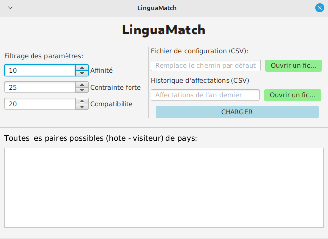

# LinguaMatch

par **WASSON Baptiste, LAGACHE Kylian, AOULAD-TAYAB Karim**

LinguaMatch est une application (avec et sans interface graphique) permettant d'automatiser le processus d'appariement entre adolescents hôtes/visiteur dans le cadre de séjours linguistiques...



**Avec LinguaMatch vous pourrez :**
- Importer un fichier CSV avec un format bien précis contentant les informations et les critères des adolescents et gérer les éventuelles incohérences (type, valeur)
- Trouver une solution sur les meilleurs appariements possibles pour tous les adolescents (si possible) via un algorithme d'affectation
- Afficher la solution via une interface graphique qui permettra également de modifier les paramètres de l'algorithme pour guider la solution mais aussi d'exporter la solution au format CSV
- Prendre en compte un historique des séjours des années précédentes pour une meilleure affectation des hôtes-visiteurs (cet historique est traité par sérialisation binaire)
- Des logs basiques rapportant les erreurs dans la console (pour l'interface graphique) lors de l'importation d'un fichier CSV

**Liens vers tous les rapports:**
- [Rapport POO](#)
- [Rapport Graphes](graphes/rapport.md)
- [Rapport IHM](#)

### Release

Vous retrouverez juste [ici](#) le fichier JAR avec toutes les classes compilées, il ne vous suffit que de lancer cette commande:

**Version console** : Cette version montre un rapide aperçu du fonctionnement du logiciel et ne fait que le strict minimum (importation / exportation CSV ou sérialisation et calcul d'affectation)

> Cette version dépend de 2 fichiers JAR, il faut donc (suivant le MANIFESt) le lancer depuis la racine du projet

```
java -jar linguamatch_console.jar
```

**Version graphique** : Cette version est la plus complète et fournit une interface graphique plus conviviale pour l'utilisateur

```
java --module-path [CHEMIN_ABSOLU_VERS_LE_DOSSIER_LIB_DE_JAVAFX_SDK_17.0.2] --add-modules javafx.controls,javafx.fxml -jar linguamatch.jar
```

### Configurer le projet

Si vous voulez manipuler le logiciel depuis le code source, vous devez le configurer...

Vous devez configurer le buildpath car ce n'est pas le même chemin selon chaque utilisateur

Dans [.vscode/settings.json](.vscode/settings.json):

```json
"java.project.referencedLibraries": [
    "CHEMIN_ABSOLU_VERS_LE_DOSSIER_LIB_DE_JAVAFX_SDK_17.0.2/*.jar",
    "lib/*.jar"
]
```

Dans le fichier global 'settings.json' de VSCode:

> Chemin de ce fichier:
> - (Linux) ~/.config/Code/User/settings.json
> - (MacOS) $HOME/Library/Application\ Support/Code/User/settings.json
> - (Windows) %APPDATA%\Code\User\settings.json

Ajouter cette ligne pour lancer correctement le fichier de test 'AffectationVersion2Test.java' (et aussi pour utiliser les fichiers JAR du dossier lib du projet que l'on peut voir ci-dessus) car il utilise des chemins relatifs pour accèder aux CSV du projet, chose que l'extension qui s'occupe des tests ne fait pas par défaut:
```json
"java.test.config": { "workingDirectory": "${workspaceFolder}" }
```

et aussi cette ligne pour lui renseigner les arguments de la JVM par défaut, en l'occurence ici c'est pour renseigner et ajouter certains modules indispensables au fonctionnement de JavaFX

```json
"java.debug.settings.vmArgs": "--module-path [CHEMIN_ABSOLU_VERS_LE_DOSSIER_LIB_DE_JAVAFX_SDK_17.0.2] --add-modules=javafx.controls,javafx.fxml"
```

## Générer la documentation en local

Pour générer la documentation Javadoc en local

> Le fichier 'package-info.java' présent dans l'arborescence sert à documenter chaque package du projet

```
javadoc -author -d doc -cp lib/sae2_02.jar:lib/jgrapht-core-1.5.1.jar --module-path [CHEMIN_ABSOLU_VERS_LE_DOSSIER_LIB_DE_JAVAFX_SDK_17.0.2] --add-modules javafx.controls,javafx.fxml -sourcepath src -subpackages LinguaMatch
```

La page principale se trouve dans ``doc/LinguaMatch/package-summary.html``