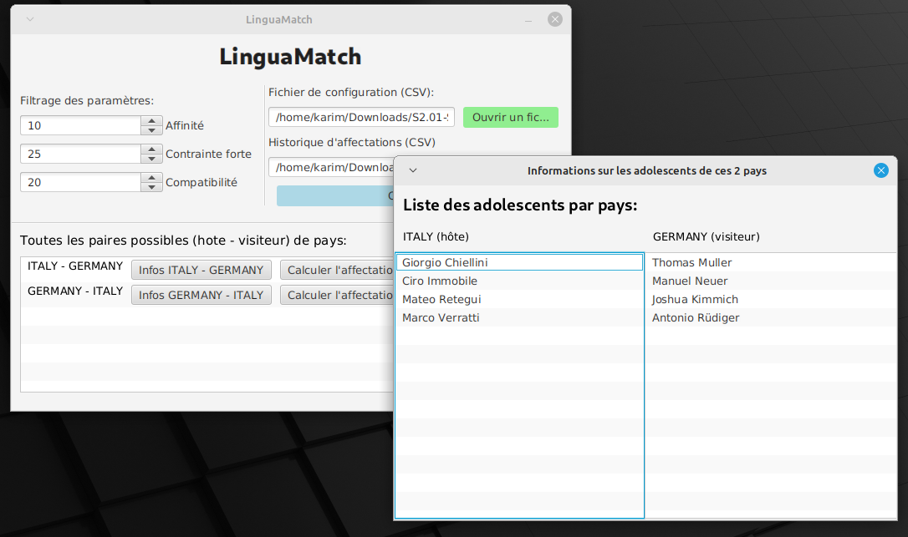
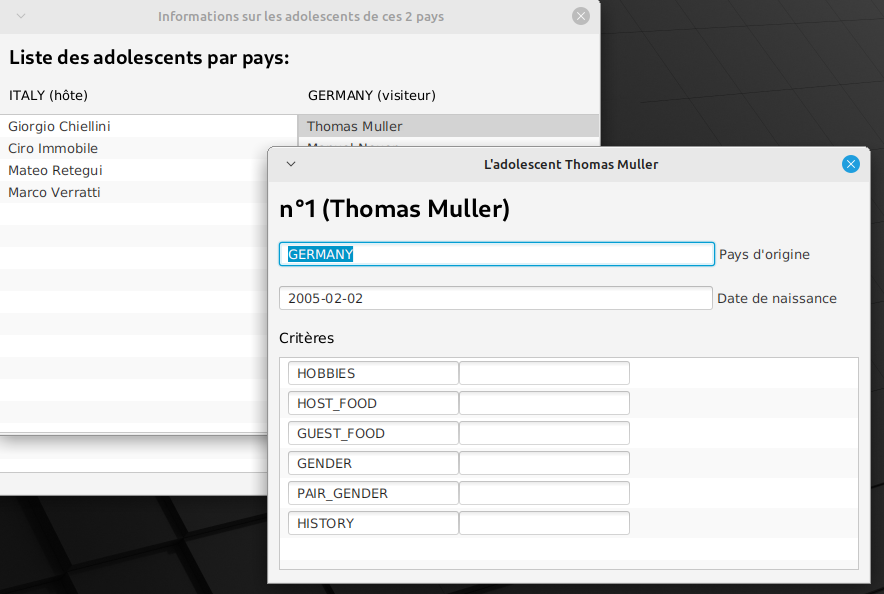
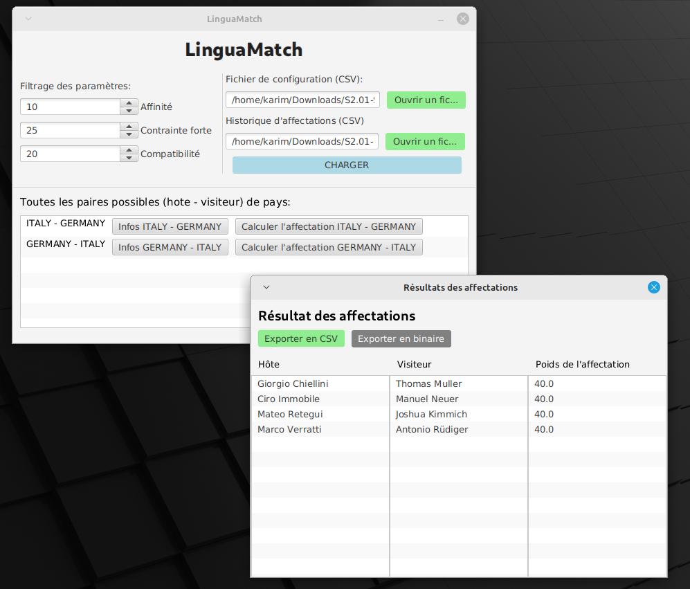

# Rapport IHM

**Instruction de compilation utilisé pour le rapport de POO et IHM**

```
pandoc --toc --metadata title=[Titre de la page] --metadata-file=metadata.yml -t pdf -f markdown --template=template/
eisvogel.tex Rapport-IHM.md -o Rapport-IHM.pdf
```

Groupe: **F6**

Membre du groupes:

- WASSON Baptiste
- AOULAD-TAYAB Karim
- LAGACHE Kylian

Ceci est le compte-rendu de la partie IHM, le dernier rendu est disponible sur Gitlab étiquetté sous le tag IHM-v2: [F6#d7228d47](https://gitlab.univ-lille.fr/sae2.01-2.02/2023/F6/-/tree/d7228d47cbce65f88aacfa970a3ea4e7897713f5)

Voici quelques captures du rendu final:

| Interface initiale | Liste des adolescents par pays | Informations d'un adolescent et ses critères | Résultat d'une affectation |
|:--------------- |:---------------:|:-----:|:-------:|
|   |  |  |  | 

### Analyse de l'interface graphique

Notre interface graphique est très basique visuellement parlant mais sur le plan ergonomique nous avons fait en sorte qu'il soit le plus simple d'utilisation pour les utilisateurs. Mais aussi nous avons fait en sorte de structurer au mieux le code pour que la conception soit plus aisée:

La structure de la partie IHM se décompose ainsi:

> Nous avons documenté chaque package avec la Javadoc (dans le code source)

```
...
- gui/
    - controller/   => Ce sont toutes les classes qui vont faire la liaison entre les données que notre logiciel
                       va traiter et l'interface sous JavaFX
    - event/        => Ce sont tous les évènements (et listeners pour les ListView, TextProperty)
    - Util.java     => Une classe dans laquelle plusieurs méthodes utiles sont définies
...
- Platform.java     => Le point d'entrée de l'application (C'est ici que le mockup de l'interface de départ (Exemple 1
                       au dessus) est chargé)
```

En effet, dans le dossier ``mockups/hifi/`` nous avons toutes les maquettes de chaque interface de l'application que nous avons crée avec SceneBuilder.

#### Première capture


Tout d'abord, nous avons placé des boutons verts pour ouvrir un fichier, nous estimons que c'est une bonne chose pour l'utilisateur car ça lui simplifiera la tâche en cherchant le fichier CSV qu'il veut importer via un explorateur de fichier (dès l'enclenchement de l'un des 2 boutons verts) et ainsi éviter de taper soi-même le chemin.

Notons également que le fichier de configuration par défaut se trouve dans ``graphes/V2/csv/exemple_minimal.csv``, nous avons également décidé d'écrire automatiquement ce chemin si l'utilisateur n'entre rien dans le premier champ. Si ce dernier veut tester l'application avec une configuration par défaut il pourra le faire assez rapidement grâce à cette fonctionnalité.

Aussi, nous avons opté pour des ``Spinner`` pour les bonus/malus car nous avons pensé que c'était un widget efficace pour ce besoin, l'utilisateur n'insérera jamais un nombre conséquent et les boutons du spinner permettent d'arriver au nombre souhaité plus rapidement et le peaufiner si l'on souhaite avec le champ qui est éditable.

Enfin nous avons placé une ListView pour afficher la liste des pays hôte-visiteur possibles afin de choisir qui seront les hôtes et qui seront les visiteurs et calculer l'affectation en conséquence. La ListView est très pratique car elle a à sa disposition un scrollbar vertical si le nombre de pays hôte-visiteur dépasse la longueur de la fenêtre.

Tout cela est geré dans le Controller ``gui/controller/MainController.java``, nous avons une méthode pour intialiser l'interface (ici cela va nous servir pour définir la valeur et le comportement par défaut des spinners mais également il y a des méthodes pour déclencher un évènement selon le bouton sur lequel on clique, ex: ``openCSV`` lorsqu'on clique sur l'un des 2 boutons 'Ouvrir un fichier')

> Pour définir le comportement et la valeur de certains composants de l'interface nous devons le coder via SceneBuilder on leur donnant un ``fx:id`` à chaque composant et/ou une méthode d'évènement mais aussi nous devons lui renseigner le Controller dans lequel il va agir.

#### Seconde capture / Troisième capture

| Liste des adolescents par pays | Informations d'un adolescent et ses critères | 
|:--------------- |:---------------:|
|  |  | 

Lorsqu'on enclenche le bouton "Infos PAYS1 - PAYS2", nous avons une fenêtre modale. Nous avons opté pour des fenêtres modales pour le reste des captures car c'est plus simple pour l'utilisateur de s'y retrouver, c'est plus clair visuellement.

Nous avons séparé les adolescents en 2 ListView (1 par pays), pour les mêmes raisons que pour la capture 1, cela permet de béneficier du scrollbar vertical qui est très pratique.

Ici, nous utilisons un fichier à part pour l'évènement car le code est assez conséquent nous avons préféré le séparer (``gui/event/ListTeenWindowEvent.java``)

Dans ce fichier, nous faisons la même chose que dans la classe ``Platform``, c'est-à-dire que nous chargeons le fichier FXML associé, ici ``mockups/hifi/liste_ados.fxml`` mais avant d'afficher la fenêtre nous affectons à 2 attributs statiques de Platform le résultat des CSV chargés (sous le type ``List<Teenager>`` pour le fichier de configuration et ``List<Arete<Teenager>>`` pour l'historique d'affectations).

Ainsi nous aurons accès à ces données depuis le nouveau Controller qui sera associé à cette interface. Dès le chargement de ce mockup ``mockups/hifi/liste_ados.fxml``, il l'initialisera dans la classe Controller que nous avons inscrit dans SceneBuilder ``gui/controller/ListTeenController.java``

C'est un peu le même principe pour la troisème fenêtre sauf qu'ici il est question de Listener, celui de ListView (``TeenWindowListener``) il est en constante écoute d'un changement au niveau de la ListView, ici le changement se caractérise par une nouvelle sélection d'un adolescent dans l'une des 2 listes.

Nous avons décidé d'utiliser des TextField car ils sont automatiquement alignable avec un Label et comme on peut rendre ces TextField impossible à éditer, cela nous a semblé être un bon choix. Cependant nous avons fait le choix de rendre éditable les critères, si l'utilisateur souhaite éditer directement depuis l'interface le critère d'un adolescent.

#### Quatrième capture


Nous avons opté ici pour 3 ListView car de cette manière nous pouvons utiliser le même Listener que celui de la capture précédente et ainsi utiliser la même interface pour afficher les informations d'un adolescent pour chaque affectation.

Les boutons pour exporter en CSV et en sérialisation binaire comme pour le bouton 'Ouvrir un fichier' vont afficher un explorateur de fichiers pour savoir où enregistrer le fichier après exportation, pour les mêmes raisons que précédemment, un explorateur de fichier est plus ergonomique que demander d'écrire dans un simple ``TextField`` le chemin du fichier qui sera exporté.

### Contributions de chaque membre du groupe

WASSON Baptiste, LAGACHE Kylian

- Réalisation des maquettes basse-fidelité via Figma

Ils ont pu trouver des bonnes idées au niveau de l'interface, donc les maquettes basse-fidelité ont été entièrement réalisés par eux.

AOULAD-TAYAB Karim

- Réalisation des maquettes haute-fidelité (via SceneBuilder)

- Développement en JavaFX

J'ai donc réalisé une maquette plus réaliste, qui tient compte de certaines contraintes en me basant évidemment sur les maquettes basse-fidelité et j'ai réalisé le code étant plus à l'aise au niveau de la conception par rapport aux 2 autres membres du groupe.