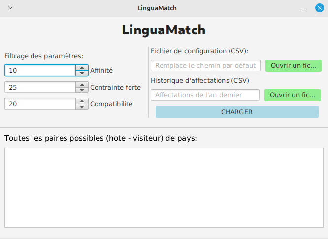

# Rapport POO

**Instruction de compilation utilisé pour le rapport de POO et IHM**

```
pandoc --toc --metadata title=[Titre de la page] --metadata-file=metadata.yml -t pdf -f markdown --template=template/
eisvogel.tex Rapport-POO.md -o Rapport-POO.pdf
```

Groupe: **F6**

Membre du groupes:

- WASSON Baptiste
- AOULAD-TAYAB Karim
- LAGACHE Kylian


### Consignes pour lancer le logiciel

Pré-requis:

- Java (>= 17)

> On peut avoir une version supérieure à 17 par rapport à la version des fichiers compilés dans le JAR de ``linguamatch-gui.jar`` pour bénéficier de la rétro-compatibilité, mais pas en dessous de 17 (``linguamatch-console.jar`` est compilé à la version 11 de Java, donc pour faire fonctionner ces 2 fichiers JAR veuillez installer une version de Java égale à 17 au minimum)

- JavaFX SDK (= 17) [ [lien de téléchargement](https://gluonhq.com/products/javafx/) ]

> Le SDK JavaFX n'est pas compatible pour tous les OS, il y a un SDK par plateforme donc il faut télécharger un SDK (de version 17 avec la bonne architecture et le bon OS)

Ces fichiers JAR dépendent d'autres fichiers JAR (présents dans le dossier lib), il faut donc (suivant le [MANIFEST](META-INF/MANIFEST.MF)) le lancer depuis la racine du projet mais également car le fichier ``linguamatch-gui.jar`` dépend des fichiers FXML (présents dans mockups/hifi) pour chacune des interfaces sur lesquelles ce logiciel se base.

**Version console** : Cette version montre un rapide aperçu du fonctionnement du logiciel et ne fait que le strict minimum (importation / exportation CSV ou sérialisation et calcul d'affectation)

```
java -jar linguamatch-console.jar
```


**Version graphique** : Cette version est la plus complète et fournit une interface graphique plus conviviale pour l'utilisateur

```
java --module-path [CHEMIN_ABSOLU_VERS_LE_DOSSIER_LIB_DE_JAVAFX] --add-modules javafx.controls,javafx.fxml -jar linguamatch-gui.jar
```



### Conception orienté objet du logiciel

La conception se décompose principalement sur 3 packages:

- LinguaMatch avec le point d'entrée (Platform) pour la version console/graphique

- LinguaMatch.core le coeur du logiciel, avec les principales fonctionnalités

- LinguaMatch.csv le package qui gère les fichiers CSV suivant


#### De l'encapsulation...

Pour commencer sur notre analyse de la conception de notre logiciel, nous pouvons évoquer le concept le plus classique en orienté objet, l'encapsulation. C'est le mécanisme le plus présent dans cette conception. Il consiste comme son nom l'indique à encapsuler un objet sous forme d'attribut dans une classe en particulier afin de tirer parti de ses fonctionnalités au sein de cette classe. Par exemple la classe Criterion encapsule un attribut privé de type CriterionName nommé label, l'intêret est de pouvoir stocker une donnée qui a ses particularités et ses comportements dont il ne peut être représenté par une type primitif.

```java
public class Criterion {
    // ...
    private CriterionName label;

    public Criterion(CriterionName label, String value) {
        this.label = label;
        // ...
    }

    // Après l'appel du constructeur nous avons un attribut de type CriterionName qui stocke une instance de ce même type, nous pouvons le manipuler de sorte à invoquer des méthodes propres à cet objet via cet attribut, ou des attributs qui seraient publiques...
}
```

Cela simplifie grandement la conception et c'est l'une des briques essentielles de l'orienté objet car souvent associé aux concepts de portée des attributs, méthodes, classes (avec les mots-clés public, private, protected, package) et de la délégation de méthodes (c'est-à-dire le fait de définir une méthode qui a le même comportement que l'une des méthodes de l'attribut encapsulé mais dans le contexte de la classe, par exemple si on encapsule un objet Person dans une classe Worker, on voudra une méthode getName() issu de l'objet encapsulé Person pour récuperer le nom du travailleur (qui définit un autre contexte autre que la personne en elle-même, même si c'est également le cas)).

##### Des enums enrichis...

Autre notion intéressante ce sont les enums, cette structure qui peut paraître très différente d'une classe est en réalité une classe statique (il n'existe pas réellement de mot-clé static, on considère qu'une classe statique est une classe dont le constructeur est privé essentiellement). En effet, les enums ne sont que du sucre syntaxique de ce code:

```java
public class MonFameuxEnum extends Enum<Enum<MonFameuxEnum>> {
    public static final UN = new MonFameuxEnum("UN", 0);
    public static final DEUX = new MonFameuxEnum("DEUX", 1);

    private static final MonFameuxEnum[] values = new MonFameuxEnum[]{UN, DEUX};

    private MonFameuxEnum(String name, int ordinal) {
        super(name, ordinal);
    }

    public static MonFameuxEnum valueOf(String name) {
        return Enum.valueOf(MonFameuxEnum.class, name)
    }

    public static MonFameuxEnum[] values() {
        return MonFameuxEnum.values;
    }
}
```

Cette structure est très utile lorsque nous voulons représenter des données de quantité finie, comme nous pouvons le remarquer dans le code ci-dessus, ce n'est que des instances de classe prédéfinies au sein de la classe elle-même et leur nom permet de les représenter de manière plus naturelle, par exemple dans notre cas, le sujet de la SaÉ nous demandait d'effectuer des affectations sur uniquement 4 pays (FRANCE, ITALIE, ESPAGNE, ALLEMAGNE), le meilleur choix est donc d'opter pour un enum...

Cependant ces données ne représentent au final que des chaînes de caractères, on aurait pu utiliser simplement un tableau de chaîne de caractères pour les représenter mais ce n'est pas le bon choix pour 2 raisons:

- 1ère raison: Conceptuellement parlant c'est moins intéressant car nous devrons systématiquement stocker la valeur dans une classe sans encapsulation et l'idée ici et d'apporter la conception la plus claire possible, si des concepts orienté objet existent pour cela il est préférable de les utiliser.

- 2ème raison: C'est la raison la plus importante, un enum n'est qu'une classe comme on vient de le voir, donc on peut l'enrichir de méthodes, d'attributs supplémentaires comme une vraie classe (car c'en est une...) donc cet aspect permet d'avoir une toute autre dimension dans l'utilisation des enums les rendant plus pratiques. Par exemple, l'enum CriterionName permet avec ce seul enum de pouvoir stocker 2 informations très liées entre elles. le nom du critère et son type associé, et pour cela nous avons la possibilité de redéfinir une constructeur privé des attributs privées (après la définition de chaque valeur de l'enum qui on rappelle ne sont que des instances de classe, il appellera donc le constructeur qu'on aura redéfini) et de lui fournir les getters ou autre méthodes que l'on souhaite, ici en l'occurence nous avons une méthode getType() pour récuperer le type en char du critère associé et un autre méthode pour récuperer le type du char avec le nom complet, utilisé pour les exceptions...

#### Un peu d'héritage et d'exceptions...

En parlant d'exceptions, le sujet de SaÉ nous demandait d'introduire un mécanisme d'exceptions, comme nous pouvons le voir dans l'UML, nous avons 2 classes gérant des exceptions particulières, l'une pour tout ce qui concerne le type des valeurs des critères d'un adolescent et l'autre la structure d'un fichier CSV. Les exceptions est un concept qui est présent dans quasiment tous les langages de programmation (même ceux qui ne sont pas orienté objet), l'intêret est d'avoir un meilleur contrôle des erreurs qui peuvent survenir au cours de l'éxecution d'un programme, certaines actions peuvent s'avérer dangeureses car comportant des risques pouvant amener à un crash (comme la lecture d'un fichier, il est possible que le chemin indiqué n'existe pas). Les exceptions sont là pour contrôler ce type de cas de figures mais également permettent au client d'informer plus clairement du problème qui vient de se produire avec un message plus clair et cela en "levant une exception" (ou en anglais throw) cela signfie que le programme va tout simplement créer une instance d'une exception et Java va s'occuper de le notifier à l'éxecution en indiquant certaines informations comme la pile d'éxecution afin de savoir à quelle ligne le problème a eu lieu et traçant ainsi la pile d'appels jusqu'à la méthode origine du problème.

Par exemple pour la gestion des fichiers dans notre logiciel, au début de la méthode checkCSVStruct(), si le nombre de colonnes d'une ligne CSV représentant un ado n'est pas identique à la première ligne représentant le nom de toutes les colonnes alors on considère que la structure n'a pas été respectée et on "lève l'exception" de cette manière:

```java
// Le "throws WrongCSVStructureException" sert à propager l'exception qui a été levé aux méthodes qui appellent checkCSVStruct afin qu'a leur tour elles lèvent l'exception créeant ainsi la pile d'éxecution
public void checkCSVStruct(String ligne, String[] valeurs) throws WrongCSVStructureException
    if(valeurs.length != this.nbCols)
        throw new WrongCSVStructureException(ligne, this.pos, "Le nombre de colonnes n'est pas identique.");
```

C'est sensiblement la même chose pour l'exception CriterionTypeException mais agissant ici dans le cas où le type d'une valeur ne correspond pas au type de l'objet CriterionName donc au type du critère.

Tout cela est possible grâce à une classe issue de Java, la classe Exception, nous avons dit que Java s'occupait de notifier l'utilisateur de certaines informations à propos de l'exception, et bien c'est grâce à la classe Exception. Cependant cette classe est trop "générique" et nous préférons évidemment utiliser cette classe Exception pour un usage plus spécifique, c'est l'une des utilités du mécanisme d'héritage en orienté objet que nous avons également utilisé lors de la conception du logiciel. L'héritage sert comme son nom l'indique à hériter des méthodes, attributs (qui sont tout sauf privés) d'une classe mère vers une classe fille et de pouvoir les utiliser au sein de cette classe fille en les invoquant grâce à un mot clé spécifique, le mot-clé super. Cette fonctionnalité permet plusieurs usages comme l'extension d'une classe, la factorisation mais dans le cas des exceptions cela sera plutôt la spécialisation.

Exemple avec l'exception WrongCSVStructureException:
```java
public class WrongCSVStructureException extends Exception {
    public WrongCSVStructureException(String ligne, int pos, String msg) {
        super("(L" + pos + ") sur la ligne '" + ligne + "':\n\t" + msg + "\n"); 
    }

    public WrongCSVStructureException(String msg) {
        super(msg);
    }
}
```

De cette manière nous bénéficions de tout ce qui est possible dans la classe Exception mais avec une constructeur différent indiquant un message différent lorsque l'exception sera levée.

#### Les interfaces et le polymorphisme...

Il n'y a pas d'interface qui a été crée au sein de ce logiciel cependant nous avons implementé sur certaines classes des interfaces pour améliorer la clarté de la conception. Les interfaces en orienté-objet remplissent un rôle différent de l'héritage malgré qu'ils partagent un point commun, c'est la possibilité d'avoir du polymorphisme en effet une classe fille qui hérite d'une classe mère on peut le considérer comme une sorte de classe mère (ex: une classe Voiture qui hérite de Vehicule est une sorte de Véhicule) et on peut prendre n'importe quel type dans la hiérarchie des classes pourvu qu'il soit au-dessus de la classe Voiture (ex: Voiture > VehiculeTerrestre > Vehicule), une voiture est une sorte de VehiculeTerrestre mais aussi une sorte de Vehicule, d'où le "poly" de polymorphisme indiquant la possibilité d'avoir **plusieurs** types au sein d'un objet.

Cependant, le rôle d'une interface est d'obliger une classe à implémenter une série de méthodes (généralement non définies dans l'interface, elle sont juste déclarées) comme une sorte de contrat à respecter, cette obligation permet d'être sûr qu'une classe respecte bien la nature de cette interface, le fait que la classe doive implémenter systématiquement la méthode sans avoir une implémentation prédéfinie c'est le principal intêret des interfaces, car on peut considèrer des classes ayant la même nature mais ayant un comportement différent. Exemple, un papier de la classe Paper peut implémenter une interface Recyclable (qui demande d'implémenter la méthode recycle()) mais une bouteille en plastique de la classe Bottle peut également implémenter cette interface, pourtant nous nous recyclerons pas un papier et une bouteille en plastique de la même manière.

Voici quelques exemples d'implémentations d'interfaces au sein du logiciel:

```java
// On peut donc dire que CSVReader est une sorte d'objet qui a la capacité de fermer un flux, en l'occurence ici un flux de données issus d'un fichiers CSV (d'où l'implémentation de la méthode close())
public class CSVReader implements Closeable {
    // ...
}
```

```java
// Ici Serializable n'est qu'un marqueur, il n'y a aucune méthode à implémenter mais sert surtout à indiquer au compilateur que Teenager est une sorte d'objet sérialisable
public class Teenager implements Serializable {
    // ...
}
```

### Analyse des fonctionnalités demandées

Nous allons analyser en profondeur plusieurs fonctionnalités importantes du logiciel afin de comprendre leur intêret et également présenter les classes Java qui interviennent dans ces fonctionnalités.

#### Gestion des critères

Criterion : Cette classe représente un critère avec un nom (CriterionName) et une valeur. Elle possède des méthodes pour obtenir le nom et la valeur du critère, transformer la valeur en tableau, inférer le type réel de la valeur, vérifier la cohérence du type de valeur avec le nom du critère, comparer l'égalité avec un autre critère et fournir une représentation sous forme de chaîne de caractères.

CriterionName : Cette énumération représente les noms des critères possibles. Chaque nom de critère est associé à un type (booléen ou texte). Il fournit des méthodes pour obtenir le type du nom du critère et obtenir le nom complet du type en fonction du type représenté par un caractère (B pour booléen, T pour texte).

Teenager : Cette classe représente un adolescent participant à un séjour linguistique. Elle contient des informations telles que l'identifiant, le prénom, le nom, la date de naissance et le pays d'origine de l'adolescent. Elle dispose également d'une table associative pour stocker les critères renseignés par l'adolescent. La classe fournit des méthodes pour accéder et modifier ces informations, ajouter et supprimer des critères, vérifier les critères incohérents et calculer la compatibilité avec un autre adolescent visiteur.

Ces classes semblent faire partie d'un système de gestion de critères pour un formulaire d'inscription à un séjour linguistique. La classe Criterion représente un critère spécifique avec son nom et sa valeur, tandis que la classe CriterionName définit les noms des critères possibles avec leur type associé. La classe Teenager utilise ces critères pour enregistrer les préférences et les informations des adolescents participants.

#### Gestion des exceptions

La fonctionnalité de gestion des exceptions implémentée dans les classes Java fournies vise à traiter les erreurs ou les situations anormales qui peuvent survenir lors de l'exécution du code. Elle permet de signaler et de gérer ces erreurs de manière appropriée pour garantir le bon fonctionnement du programme.

Plus précisément, voici comment fonctionne cette fonctionnalité : La classe CriterionTypeException est une exception personnalisée qui est levée lorsqu'un type de critère incorrect est détecté. Elle hérite de la classe Exception, qui est la classe de base pour toutes les exceptions en Java. Cette exception est utilisée pour indiquer qu'une valeur donnée ne correspond pas au type attendu d'un critère.

La classe CSVReader est une classe qui lit des fichiers CSV conformes à certaines contraintes. Elle est utilisée pour lire et analyser des fichiers CSV dans le cadre du programme. Cette classe comporte plusieurs méthodes et attributs pour gérer la lecture, le traitement et la validation des données CSV.

La classe WrongCSVStructureException est une exception personnalisée qui est levée lorsque la structure d'un fichier CSV est incorrecte. Elle est utilisée pour signaler les problèmes de structure rencontrés lors de la lecture d'un fichier CSV. Cette exception contient des informations sur la ligne en question, sa position dans le fichier et le message d'erreur correspondant.

Lorsque des erreurs ou des situations anormales se produisent, ces exceptions sont levées et peuvent être capturées et traitées par le code qui utilise ces classes. Par exemple, si un fichier CSV ne respecte pas la structure attendue, une instance de WrongCSVStructureException sera levée, contenant des informations sur l'erreur spécifique.
En capturant ces exceptions, le code peut effectuer des actions spécifiques pour gérer les erreurs. Par exemple, il peut afficher un message d'erreur à l'utilisateur, en fournissant des détails sur l'erreur et les étapes à suivre pour la corriger. Le code peut également prendre des mesures correctives, comme demander à l'utilisateur de fournir un fichier CSV correctement structuré.

En résumé, la fonctionnalité de gestion des exceptions dans ces classes Java permet de détecter, signaler et gérer les erreurs ou les situations anormales qui peuvent survenir lors de la lecture et du traitement des fichiers CSV. Elle garantit un fonctionnement plus robuste du programme en fournissant des informations détaillées sur les erreurs et en permettant leur gestion appropriée.

#### Gestion des fichiers CSV respectant une structure particulière

La classe CSVReader est utilisée pour lire les fichiers CSV et extraire les données. Elle utilise un Scanner pour lire le fichier ligne par ligne. Les données sont ensuite parsées et stockées dans des listes correspondant au format standard ou à l'historique d'affectation. La classe CSVReader implémente également l'interface Closeable, ce qui permet de fermer le flux de lecture une fois que l'opération de lecture est terminée.

La classe WrongCSVStructureException est une exception personnalisée qui est levée lorsqu'une structure de fichier CSV incorrecte est détectée pendant la lecture. Elle contient des informations sur la ligne et la position où l'erreur a été détectée.

La classe CSVFileType est une énumération qui définit les deux formats de fichier CSV pris en charge : STANDARD et HISTORY. Chaque format a un nombre spécifique d'adolescents par ligne.

La classe CSVUtil fournit des méthodes utilitaires pour les opérations sur les fichiers CSV. Elle définit le délimiteur de colonne, compte le nombre de points-virgules dans une ligne CSV, remplit un tableau avec des chaînes vides si la ligne ne contient que des colonnes vides, etc.

La classe CSVWriter est utilisée pour écrire des données dans un fichier CSV. Elle utilise un BufferedWriter pour écrire les données ligne par ligne.

#### Calcul d'affectation, modification des bonus/malus

La classe "Affectation" est une classe qui gère les affectations entre adolescents via un graphe biparti. Elle utilise les classes et interfaces suivantes : "GrapheNonOrienteValue" (qui est un graphe non orienté avec des valeurs associées aux arêtes), "Arete" (qui représente une arête dans un graphe), "CalculAffectation" (qui effectue le calcul des affectations) et "SubsetGraph" (qui est une énumération pour représenter les sous-ensembles du graphe biparti).

La classe "AffectationUtil" est une classe qui contient des méthodes utilitaires pour l'affectation entre adolescents. Elle comprend des méthodes pour vérifier si un tableau contient au moins l'un des éléments d'un autre tableau, calculer les bonus/malus d'affinité/contrainte, calculer les critères basés sur l'historique d'affectations, obtenir toutes les paires possibles de pays, et ajouter des adolescents et des arêtes dans une affectation.

En résumé, la classe "Affectation" gère les affectations entre adolescents en utilisant un graphe biparti, tandis que la classe "AffectationUtil" fournit des méthodes utilitaires pour faciliter le processus d'affectation.

#### Gestion de l'historique (exportation au format CSV et par sérialisation binaire)

La classe CSVWriter est responsable de l'écriture des affectations dans un fichier CSV (Comma-Separated Values) respectant un certain format. Elle prend en paramètre le chemin du fichier CSV et utilise un flux d'écriture pour écrire les données. La méthode write reçoit une liste d'affectations entre adolescents et les écrit dans le fichier CSV en respectant le format requis.

La classe Affectation gère les affectations entre adolescents en utilisant un graphe biparti. Elle possède des listes pour stocker les sommets (adolescents) des parties gauche et droite du graphe. Les méthodes ajouterAdolescent et ajouterCoupleHoteVisiteur permettent d'ajouter des adolescents en tant que sommets du graphe biparti et d'ajouter des arêtes (relations) entre les adolescents avec des poids calculés en fonction des contraintes et affinités.

La méthode calculerAffectation effectue le calcul des affectations en utilisant le graphe biparti, les listes de sommets gauche et droite. Le résultat des affectations est stocké dans une liste d'objets Arete<Teenager>, qui représente les paires formées entre les adolescents.
Les classes Affectation et CSVWriter utilisent une sérialisation personnalisée pour pouvoir sauvegarder et récupérer l'état des objets. Cela leur permet de conserver l'historique des affectations entre différentes exécutions de l'application.

En résumé, la fonctionnalité de gestion de l'historique permet de sauvegarder les affectations entre adolescents dans un fichier CSV et de les charger ultérieurement pour récupérer l'historique des paires formées. Cela permet de suivre les évolutions et les changements dans les relations entre les adolescents au fil du temps.

### Analyse des tests effectués dans le cadre de ce logiciel

Dans chacun des tests, nous avons évidemment fait en sorte de couvrir le plus de cas possibles et surtout couvrir les cas les plus "inédits" pour s'assurer du bon fonctionnement de la méthode. Ces tests se déroulent via le framework JUnit 5, il existe un fichier JAR qui comprend tout ce qu'il faut pour éxecuter les tests et c'est bien avec VSCode et l'extension Test Runner for Java que nous avons effectué les tests, ce dernier se base ainsi sur le fichier JAR JUnit.

#### Les tests pour la partie POO

En commençant par [CriterionNameTest](test/LinguaMatchTests/CriterionTest.java), c'est le test le plus simple. Ce test vérifie uniquement que chaque valeur de l'enum stocke bien le type correspondant en vérifiant avec assertEquals la valeur attendue par rapport à la valeur obtenue, au lieu de vérifier chaque valeur on prend uniquement les valeurs qui ont des types différents pour ainsi effectuer les tests plus pertinents et cela pour n'importe quel fichier de test.

Pour [CriterionTest](test/LinguaMatchTests/CriterionTest.java), c'est la même chose pour la méthode infer(), cependant nous avons décidé d'utiliser une nouvelle méthode assert pour isValid() car c'est une méthode qui lève une exception, nous avons pensé que c'était une bonne idée d'invoquer la méthode assertThrows qui prend en paramètre l'objet Class associé à la classe CriterionTypeException et une fonction (ici une fonction anonyme) dans lequel nous mettons toutes les assertions, instructions. Ici, nous voulons vérifier que le critère 1 et 3 sont valides (avec assertTrue) mais que le 3ème critère lève une exception car invalide. Cela a pour conséquence de retourner l'exception, si tel est le cas alors le test passe car cela veut dire que le critère 3 est bien invalide sinon assertThrows lévère une exception et le test ne passerait pas.

Ensuite, nous avons le test [TeenagerTest](test/LinguaMatchTests/TeenagerTest.java), nous pouvons souligner le fait que l'initialisation se fait "statiquement", nous devons créer nous même les adolescents, chose qu'on ne fait plus grâce à la gestion des fichiers CSV. Mais également, nous avons décidé d'utiliser directement le hashmap pour certains tests car nous testons la méthode addCriterion, il faudrait pas qu'on invoque une méthode qu'on teste plus tard, ce ne serait pas cohérent dans le cadre de ce fichier test.

Pour finir, le test [PlatformTest](test/LinguaMatchTests/PlatformTest.java), doit également initialiser des adolescents cependant, nous utilisons ici directement la méthode addCriterion pour se simplifier la tâche, nous estimons que la méthode addCriterion ne doit pas être invoqué à l'initialisation dans un contexte où nous vérifions cette méthode. Ce qui n'est pas le cas de ce fichier de test.

#### Les tests pour la partie Graphes

Nous avons 2 versions de la partie Graphes, donc 2 fichiers de tests [AffectationVersion1Test](test/LinguaMatchTests/AffectationVersion1Test.java) et [AffectationVersion2Test](test/LinguaMatchTests/AffectationVersion2Test.java)

Dans ces 2 tests, nous effectuons globalement le même procédé au niveau des tests:
- Nous créeons un graphe biparti
- Nous lui ajoutons tous les adolescents en tant que sommets du graphe (que nous avons crée)
- Nous lui ajoutons équitablement des adolesnts dans le membre de gauche du graphe et des adolescents dans le membre de droite du graphe
- Nous ajoutons une arête à tous les adolescents du membre de droite pour chaque ado du membre de gauche, afin d'obtenir un graphe biparti complet
- La seule méthode de test est prête à calculer l'affectation et vérifier les résultats avec des assertions

Pour cela nous utilisons la bibliothèque fournie spécifiquement pour la partie graphes de cette SaÉ, cependant j'ai tout de même crée une classe Affectation pour centraliser tous ces traitement et simplifier ainsi considérablement l'écriture du code et donc du test, au sein d'un objet de type Affectation sera stocké la liste des sommets du membre de gauche, de droite, le graphe biparti et la liste des affectations (qui est vide avant le calcul d'affectation), cet objet me sert donc également pour la sérialisation binaire.

Pour la version 2, nous notons plusieurs différence. Désormais, nous avons la possibilité d'utiliser les classes qui gèrent la lecture de fichiers CSV, cela nous simplifie encore plus la tâche car nous n'avons nullement besoin de créer les adolescents. Nous avons également fait attention à rendre compatible ce test sur Windows, en utilisant l'attribut ``File.separator`` qui va déduire le séparateur de fichier à utiliser selon l'OS dans lequel on éxecute ce test, c'est indispensable pour charger les fichiers CSV.

Enfin, nous avons déclaré une méthode utile au sein de cette classe, car contrairement au fichier de test de la V1, nous n'avons plus forcément une petite quantité d'adolescents mais potentiellement une infinité qui sont stockés dans le CSV, nous devons donc chercher l'adolescent qui nous interésse, d'ou l'implémentation de la méthode searchTeenager() dans lequel on lui en paramètre son prénom et la liste des adolescents (issu du parsing des fichiers CSV qui ont été chargé à l'initialisation).