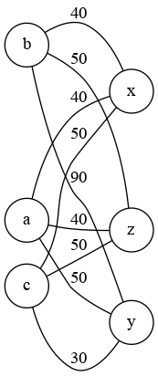

SAE S2.02 -- Rapport pour la ressource Graphes
===

*AOULAD-TAYAB Karim, LAGACHE Kylian, WASSON Baptiste, Groupe F*

Version 1
---

Sera évaluée à partir du tag git `Graphes-v1`
### Étude d'un premier exemple

> Énumérer tous les appariements acceptables (c'est à dire qui associent des adolescents compatibles) pour les données de l'Exemple 1, en supposant que les français rendent visite aux italiens.

Dans cet exemple, il y a plusieurs appariements possibles :
- Adonia et Xolag : Adonia aime la technologie comme Xolag.
- Adonia et Zander : Adonia aime la technologie comme Zander. Anodia ne peut pas aller avec Yak puisqu'elle n'a aucun passe-temps en commun avec lui.
- Bellatrix et Xolag : Bellatrix aime la culture comme Xolag. Elle ne peut pas aller avec Yak, car elle est allergique aux animaux. Elle ne peut pas aller non plus avec Zander car elle n'a aucun hobby en commun avec lui.
- Callista et Yak : Callista aime les sciences et lire, tout comme Yak.

> Justifier pourquoi l'appariement optimal est Bellatrix--Xolag, Adonia--Zander, et Callista--Yak; cette explication ne doit pas parler de graphes, mais se baser uniquement sur les données du problème.

L'appariement optimal est Bellatrix--Xolag, Adonia--Zander, et Callista--Yak car : 
- Callista ne peut aller avec personne d'autre que Yak, car elle n'a aucun passe-temps en commun avec les autres personnes.
- Bellatrix ne peut aller avec personne d'autre que Xolag car elle est allergique aux animaux et n'a pas de passe-temps en commun avec les autres.
- Adonia est donc obligée d'aller avec Zander étant donné que les autres personnes ont déjà une affectation et qu'elle a des passe-temps en commun avec lui.

### Modélisation de l'exemple

> Donner un graphe qui modélise l'Exemple 1, plus précisément, la matrice d'adjacence de ce graphe. Expliquez comment vous avez choisi le poids pour chacune des arêtes.

Matrice d'adjacence:
/ | a | b | c | x | y | z |
--|---|---|---|---|---|---|
a | 0 | 0 | 0 | 1 | 1 | 1 |
b | 0 | 0 | 0 | 1 | 1 | 1 |
c | 0 | 0 | 0 | 1 | 1 | 1 |
x | 1 | 1 | 1 | 0 | 0 | 0 |
y | 1 | 1 | 1 | 0 | 0 | 0 |
z | 1 | 1 | 1 | 0 | 0 | 0 |

Nous avons choisi ces poids :

- +50 : de base
- +50 : s'il y a une incompatibilité (ex: allergie)
  => **C'est autant que le poids de base car c'est quelque chose qu'on veut éviter à tout prix, donc on limite les affectations contre avec cette contrainte.**
- -10 : s'il y a une affinité
  => **Une affinité ne vaut pas beaucoup mais accumulé cela devient significatif.**
- (+/-) 25 : si c'est une contrainte forte (plus tard...) (ex: "same" chez 2 adolescents pour le critère "HISTORY")
  => -25 si la contrainte est respectée
  => +25 si la contrainte n'est pas respectée

### Modélisation pour la Version 1

> Décrire une modélisation générale pour la Version 1. C'est à dire, donner une formule ou une description précise qui décrit comment, étant donné un adolescent hôte et un adolescent visiteur, on détermine le poids de l'arête entre ces deux adolescents en fonction des critères considérés dans la Version 1.

Au départ chaque adolescent à un poids de 50 entre tous les autres adolescents et le but et d'augmenter énormement le poids lorsqu'il y a un incomptabilité donc on a décidé d'ajouter 50. Cependant ce poids se réduit de 10 pour chaque bonus d'affinité pour faire correspondre avec d'autres adolescents. Donc plus le poids est grand moins il y a de compatibilité et d'affinité.

### Implémentation de la Version 1

> Cette partie du travail sera évaluée à partir du code. Implémenter la fonction weight de la classe AffectationUtil en suivant la modélisation proposée. Puis, implémenter une classe TestAffectationVersion1 qui montre que votre implémentation est correcte. La classe de test doit contenir au moins une méthode de test comme ceci:

- [x] *Créer les adolescents de l'Exemple 1*
- [x] *Construire le graphe modèle pour ces adolescents; le graphe sera de type fr.ulille.but.GrahpeNonOrienteValue*
- [x] *Calculer l'affectation optimale en utilisant la classe fr.ulille.but.CalculAffectation*
- [x] *Écrire des assertions (assertEquals ...) qui vérifient que le résultat de l'affectation calculé à l'étape précédente est bien celui attendu*

### Exemple de vérification de l'incompatibilité 

Cet exemple va mettre au défi votre modèle vis à vis de la prise en compte de l'incompatibilité entre adolescents 

> Récupérez sur Moodle le fichier de données `compatibilityVsHobbies.csv`. Expliquez quelle est sa particularité de cet exemple. Écrire la méthode de test qui test qui change cet exemple, construit le graphe modèle, calcule l'affectation, et finalement vérifie qu'aucune paire d'adolescents non compatibles n'a été construite par l'algorithme.

Version 2
---

Sera évaluée à partir du tag git `Graphes-v2`

### Exemple minimal pour la gestion de l'historique

> Présenter un exemple minimal qui est pertinent pour tester l'historique. L'exemple contiendra:
> - *huit adolescents de deux pays différents tels que* 
>  - *certains des adolescents expriment des préférences d'historique (critère HISTORY). Toutes les valeurs possibles pour ce critère doivent être présentes* 
>  - *aucun des adolescents n'est allergique aux animaux en aucun n'a exprimé de passe-temps, ainsi pour l'instant on peut se concentrer uniquement sur la gestion de l'historique*
>  - *un historique, c'est à dire une collection de paires d'adolescents qui étaient correspondants l'année passée. Ces paires doivent permettre d'illustrer les différents cas de figure qui peuvent se présenter par rapport aux contraintes d'historique et les huit adolescents*

[Exemple minimal dans ce fichier CSV](./exemple2.csv)

> Puis, donner un appariement optimal qui tient compte des données d'historique, et expliquer pourquoi il est optimal. L'explication ne doit pas parler des graphes, mais uniquement des adolescents et les critères exprimés.

  1. Alex est apparié avec Ben.
  2. Charlie est apparié avec Dana.
  3. Ethan est apparié avec Fiona.
  4. George est apparié avec Hannah.

Explication de l'appariement optimal :

  - Alex et Ben : Ils sont tous les deux du même pays (Country1) et n'ont pas exprimé de préférence d'historique. Ils partagent le même genre (Male-Female), ce qui les rend compatibles en termes de pair_gender. Leur historique correspondant précédent (Alex-Ben) est également pris en compte, ce qui en fait un appariement optimal.
  - Charlie et Dana : Charlie a exprimé une préférence d'être avec quelqu'un du même pays, tandis que Dana préfère être avec quelqu'un du Country2. Cependant, il n'y a pas de correspondance directe pour leurs préférences. Ils partagent le même genre (Male-Female) et leur historique correspondant précédent (Charlie-Dana) est pris en compte, ce qui en fait un appariement optimal compte tenu de ces contraintes.
  - Ethan et Fiona : Ethan et Fiona sont tous deux du Country2 et n'ont pas exprimé de préférence d'historique. Ils partagent le même genre (Male-Female) et leur historique correspondant précédent (Ethan-Fiona) est pris en compte, ce qui en fait un appariement optimal.
  - George et Hannah : George a exprimé une préférence d'historique différente de celle de Hannah. Cependant, ils partagent le même genre (Male-Female) et leur historique correspondant précédent (George-Hannah) est pris en compte, ce qui en fait un appariement optimal compte tenu de ces contraintes.

### Deuxième exemple pour la gestion d'historique

> Modifiez l'exemple précédent en ajoutant des préférences liées aux passe-temps. Donnez l'appariement que vous considérez optimal dans ce cas. En particulier, expliquez comment vous comptez combiner une éventuelle affinité liée à l'historique avec l'affinité liée aux passe-temps. Rappelons que l'historique peut compter comme une contrainte rédhibitoire ou comme une préférence, voir le sujet pour plus de précisions.

...

> Donner l'appariement que vous considérez optimal dans ce deuxième exemple, toujours sans parler de graphes.

...

### Modélisation pour les exemples

> Pour chacun des deux exemples précédents, donnez un graphe (donné par sa matrice d'adjacence) tel que l'affectation minimale dans ce graphe correspond à l'appariement optimal identifié plus haut. Expliquez comment vous avez choisi le poids pour chacune des arêtes.

...

### Modélisation pour l'historique de la Version 2

> Décrire une modélisation générale pour la Version 1. C'est à dire, donner une formule ou une description précise qui décrit comment, étant donné un adolescent hôte et un adolescent visiteur, on détermine le poids de l'arête entre ces deux adolescents en fonction des critères considérés dans la Version 1. Décrire également comment vous construisez le graphe modèle à partir des données en entrée.

...

### Implémentation de l'historique de la Version 2

> Quelles fonctions de votre code avez-vous modifié pour prendre en compte le critère historique ? Donnez ici les noms des méthodes (et leur classe), à quoi elles servent, et quelles modifications vous avez apportées. Essayez d'être synthétique.

...

### Test pour l'historique de la Version 2

> Créer la classe de TestAffectationVersion2 qui contiendra deux méthodes de test, une pour chacun des exemples. Chacune de ces méthodes doit avoir la même structure que pour TestAffectationVersion1, c'est à dire créer les données d'entrée (adolescents, historique), créer le graphe, calculer l'affectation, et tester que le résultat est comme attendu.

...

### Prendre en compte les autres préférences

> Pour chacun des autres critères d'affinité que vous décidez de prendre en compte, décrire comment vous changez la fonction weight de la classe AffectationUtil.

...

### L'incompatibilité en tant que malus

> Proposer une formule ou une description précise qui explique comment calculer le poids d'une arête en considérant les incompatibilités comme des malus et les critères satisfaits comme des bonus. Implémenter cette formule dans une seconde méthode appelée `weightAdvanced`, ceci pour éviter de casser votre code. Puis, écrire une méthode de test qui permet d'illustrer le calcul d'affectation basé sur `weightAdvanced`. Vous pouvez égalmente tester l'affectation en utilisant le fichier de données `incompatibilityVsBonus.csv`.

...

