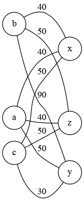
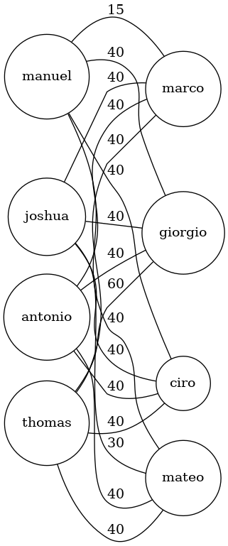
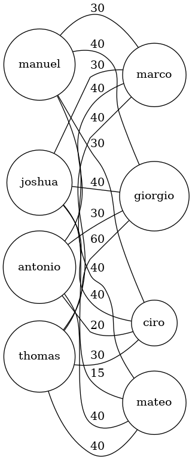

SAE S2.02 -- Rapport pour la ressource Graphes
===

*AOULAD-TAYAB Karim, LAGACHE Kylian, WASSON Baptiste, Groupe F*

Version 1
---

Sera évaluée à partir du tag git `Graphes-v1`

### Étude d'un premier exemple

> Énumérer tous les appariements acceptables (c'est à dire qui associent des adolescents compatibles) pour les données de l'Exemple 1, en supposant que les français rendent visite aux italiens.

Dans cet exemple, il y a plusieurs appariements possibles :
- Adonia et Xolag : Adonia aime la technologie comme Xolag.
- Adonia et Zander : Adonia aime la technologie comme Zander. Anodia ne peut pas aller avec Yak puisqu'elle n'a aucun passe-temps en commun avec lui.
- Bellatrix et Xolag : Bellatrix aime la culture comme Xolag. Elle ne peut pas aller avec Yak, car elle est allergique aux animaux. Elle ne peut pas aller non plus avec Zander car elle n'a aucun hobby en commun avec lui.
- Callista et Yak : Callista aime les sciences et lire, tout comme Yak.

> Justifier pourquoi l'appariement optimal est Bellatrix--Xolag, Adonia--Zander, et Callista--Yak; cette explication ne doit pas parler de graphes, mais se baser uniquement sur les données du problème.

L'appariement optimal est Bellatrix--Xolag, Adonia--Zander, et Callista--Yak car : 
- Callista ne peut aller avec personne d'autre que Yak, car elle n'a aucun passe-temps en commun avec les autres personnes.
- Bellatrix ne peut aller avec personne d'autre que Xolag car elle est allergique aux animaux et n'a pas de passe-temps en commun avec les autres.
- Adonia est donc obligée d'aller avec Zander étant donné que les autres personnes ont déjà une affectation et qu'elle a des passe-temps en commun avec lui.

### Modélisation de l'exemple

> Donner un graphe qui modélise l'Exemple 1, plus précisément, la matrice d'adjacence de ce graphe. Expliquez comment vous avez choisi le poids pour chacune des arêtes.



Matrice d'adjacence:
/ | a | b | c | x | y | z |
--|---|---|---|---|---|---|
a | 0 | 0 | 0 | 40 | 50 | 40 |
b | 0 | 0 | 0 | 40 | 90 | 50 |
c | 0 | 0 | 0 | 50 | 30 | 50 |
x | 40 | 40 | 50 | 0 | 0 | 0 |
y | 50 | 90 | 30 | 0 | 0 | 0 |
z | 40 | 50 | 50 | 0 | 0 | 0 |

Nous avons choisi ces poids :

- +50 : de base
- +50 : s'il y a une incompatibilité (ex: allergie)
  => **C'est autant que le poids de base car c'est quelque chose qu'on veut éviter à tout prix, donc on limite les affectations avec cette contrainte.**
- -10 : s'il y a une affinité
  => **Une affinité ne vaut pas beaucoup mais accumulé cela devient significatif.**
- -25 : si c'est une contrainte forte (pour la V2) (ex: "same" chez 2 adolescents pour le critère "HISTORY")
  => -25 si la contrainte est respectée

### Modélisation pour la Version 1

> Décrire une modélisation générale pour la Version 1. C'est à dire, donner une formule ou une description précise qui décrit comment, étant donné un adolescent hôte et un adolescent visiteur, on détermine le poids de l'arête entre ces deux adolescents en fonction des critères considérés dans la Version 1.

Au départ chaque adolescent à un poids de 50 entre tous les autres adolescents et le but est de diminuer ce poids pour que dans l'algorithme d'affectation il le prenne plus en considération lors de l'affectation. S'il y a une incompatibilité entre 2 ados on ajoute un malus d'incompatibilité pour augmenter le poids et le rendre moins intéressant et nous nous arrêtons là car il ne sert à rien (dans cette V1) de comparer également les affinités car les 2 sont incompatibles dès le départ.

Cependant si les 2 ados sont compatibles, nous pouvons réduire de 10 (bonus d'affinité) chaque affinité satisfaite.

### Implémentation de la Version 1

> Cette partie du travail sera évaluée à partir du code. Implémenter la fonction weight de la classe AffectationUtil en suivant la modélisation proposée. Puis, implémenter une classe TestAffectationVersion1 qui montre que votre implémentation est correcte. La classe de test doit contenir au moins une méthode de test comme ceci:

- [x] *Créer les adolescents de l'Exemple 1*
- [x] *Construire le graphe modèle pour ces adolescents; le graphe sera de type fr.ulille.but.GrahpeNonOrienteValue*
- [x] *Calculer l'affectation optimale en utilisant la classe fr.ulille.but.CalculAffectation*
- [x] *Écrire des assertions (assertEquals ...) qui vérifient que le résultat de l'affectation calculé à l'étape précédente est bien celui attendu*

### Exemple de vérification de l'incompatibilité 

Cet exemple va mettre au défi votre modèle vis à vis de la prise en compte de l'incompatibilité entre adolescents 

> Récupérez sur Moodle le fichier de données `compatibilityVsHobbies.csv`. Expliquez quelle est sa particularité de cet exemple. Écrire la méthode de test qui test qui change cet exemple, construit le graphe modèle, calcule l'affectation, et finalement vérifie qu'aucune paire d'adolescents non compatibles n'a été construite par l'algorithme.

La particularité de cet exemple, est qu'il comporte des lignes avec beaucoup de colonnes, il ne faut pas les prendre en compte car ils ne respectent pas la structure CSV demandé. K'objectif à terme est de pouvoir importer les fichiers CSV et de détecter, conserver les erreurs de lignes CSV pour pouvoir éventueller les signaler et pour les autres lignes, les traiter pour dans la plateforme d'affectation.

Version 2
---

Sera évaluée à partir du tag git `Graphes-v2`

### Exemple minimal pour la gestion de l'historique

> Présenter un exemple minimal qui est pertinent pour tester l'historique. L'exemple contiendra:
> - *huit adolescents de deux pays différents tels que* 
>  - *certains des adolescents expriment des préférences d'historique (critère HISTORY). Toutes les valeurs possibles pour ce critère doivent être présentes* 
>  - *aucun des adolescents n'est allergique aux animaux en aucun n'a exprimé de passe-temps, ainsi pour l'instant on peut se concentrer uniquement sur la gestion de l'historique*
>  - *un historique, c'est à dire une collection de paires d'adolescents qui étaient correspondants l'année passée. Ces paires doivent permettre d'illustrer les différents cas de figure qui peuvent se présenter par rapport aux contraintes d'historique et les huit adolescents*

Voici un exemple:
```
FORENAME;NAME;COUNTRY;BIRTH_DATE;HOBBIES;GUEST_ANIMAL_ALLERGY;HOST_HAS_ANIMAL;GUEST_FOOD;HOST_FOOD;GENDER;PAIR_GENDER;HISTORY
Giorgio;Chiellini;ITALY;2005-07-07;;;;;;;;other
Thomas;Muller;GERMANY;2005-02-02;;;;;;;; 
Ciro;Immobile;ITALY;2005-03-03;;;;;;;;
Manuel;Neuer;GERMANY;2005-05-05;;;;;;;;same
Mateo;Retegui;ITALY;2005-06-06;;;;;;;;
Joshua;Kimmich;GERMANY;2005-08-08;;;;;;;;same
Marco;Verratti;ITALY;2005-04-04;;;;;;;;same
Antonio;Rüdiger;GERMANY;2005-01-01;;;;;;;;
```

Voici les appariements précédents (issu de l'historique) en prenant en compte le critère HISTORY des 8 adolescents:

- Giorgio-Thomas (contrainte rédhibitoire) : other - ...
- Ciro-Antonio : ... - ...
- Mateo-Joshua (contrainte forte) : same - same
- Manuel-Marco (affinité) : ... - same


et un historique d'affectation:
```
FORENAME;NAME;COUNTRY;BIRTH_DATE;HOBBIES;GUEST_ANIMAL_ALLERGY;HOST_HAS_ANIMAL;GUEST_FOOD;HOST_FOOD;GENDER;PAIR_GENDER;HISTORY;FORENAME;NAME;COUNTRY;BIRTH_DATE;HOBBIES;GUEST_ANIMAL_ALLERGY;HOST_HAS_ANIMAL;GUEST_FOOD;HOST_FOOD;GENDER;PAIR_GENDER;HISTORY
Giorgio;Chiellini;ITALY;2005-07-07;;;;;;;;;Thomas;Muller;GERMANY;2005-02-02;;;;;;;;
Ciro;Immobile;ITALY;2005-03-03;;;;;;;;;Antonio;Rüdiger;GERMANY;2005-01-01;;;;;;;;
Mateo;Retegui;ITALY;2005-06-06;;;;;;;;;Joshua;Kimmich;GERMANY;2005-08-08;;;;;;;;
Manuel;Neuer;GERMANY;2005-05-05;;;;;;;;;Marco;Verratti;ITALY;2005-04-04;;;;;;;;
```

> Puis, donner un appariement optimal qui tient compte des données d'historique, et expliquer pourquoi il est optimal. L'explication ne doit pas parler des graphes, mais uniquement des adolescents et les critères exprimés.

Donc l'appariement optimal est:

- Giorgio - Antonio car il y a une contrainte rédhibitoire entre Giorgio et Thomas et Joshua a une contrainte forte avec Mateo donc il reste Antonio

- Thomas ira avec Ciro car Mateo a une contrainte forte avec Joshua, il reste que Ciro qui n'exprime aucune contrainte particulière et Marco qui exprime une affinitié avec Manuel

- Manuel - Marco car Marco exprime une affinité avec Manuel

- Pour finir, la contrainte forte est respecté avec l'affectation Mateo - Joshua

### Deuxième exemple pour la gestion d'historique

> Modifiez l'exemple précédent en ajoutant des préférences liées aux passe-temps. Donnez l'appariement que vous considérez optimal dans ce cas. En particulier, expliquez comment vous comptez combiner une éventuelle affinité liée à l'historique avec l'affinité liée aux passe-temps. Rappelons que l'historique peut compter comme une contrainte rédhibitoire ou comme une préférence, voir le sujet pour plus de précisions.

Voici l'exemple avec les passes-temps en plus:
```
FORENAME;NAME;COUNTRY;BIRTH_DATE;HOBBIES;GUEST_ANIMAL_ALLERGY;HOST_HAS_ANIMAL;GUEST_FOOD;HOST_FOOD;GENDER;PAIR_GENDER;HISTORY
Giorgio;Chiellini;ITALY;2005-07-07;technology,science;;;;;;;other;
Thomas;Muller;GERMANY;2005-02-02;reading;;;;;;;;
Ciro;Immobile;ITALY;2005-03-03;technology,reading;;;;;;;;
Manuel;Neuer;GERMANY;2005-05-05;reading,culture;;;;;;;;
Mateo;Retegui;ITALY;2005-06-06;science;;;;;;;same;
Joshua;Kimmich;GERMANY;2005-08-08;sports,culture;;;;;;;same;
Marco;Verratti;ITALY;2005-04-04;science,sports;;;;;;;same;
Antonio;Rüdiger;GERMANY;2005-01-01;reading,technology;;;;;;;;
```

L'appariement optimal proposé est:

- Joshua - Mateo car ils ont une contrainte forte sur l'historique, il serait donc plus intéressant de les placer ensemble

- Thomas - Ciro car Thomas ne peut être avec Giorgio car ce dernier exprime une contrainte rédhibitoire (sur l'historique) envers Thomas et Thomas a une affinité (hobbies) avec Ciro

- Antonio - Giorgio car Antonio exprime une hobby commun à Giorgio

- Manuel - Marco malgré qu'ils ne comportent aucune affinité, ils restent tout de même compatibles donc on peut les placer ensemble

> Une autre possibilité d'affectation aurait été Antonio - Ciro car ils auraient 2 passes-temps en comumn et pas 1 mais les affinités restent plus faibles par rapport aux contraintes rédhibitoires, fortes...

Afin de combiner le critère "HOBBIES" et "HISTORY", en sachant que ce dernier peut-être une contraine rédhibitoire, forte ou une affinité. Nous avons introduit une degré d'incompatibilité. Désormais on ne regarde plus si l'ado est compatible ou non mais à quel point il l'est pour le compenser avec les bonus d'affinités. Donc on calcule des malus de contrainte (ou on les soustrait si c'est une contrainte forte qui respectée) et on les ajoute au poids final.

### Modélisation pour les exemples

> Pour chacun des deux exemples précédents, donnez un graphe (donné par sa matrice d'adjacence) tel que l'affectation minimale dans ce graphe correspond à l'appariement optimal identifié plus haut. Expliquez comment vous avez choisi le poids pour chacune des arêtes.

Le poids concernant les contrainte rédhibitoire a été abandonné (utilisé uniquement que pour la V1) car nous avons introduit le degré d'incompatibilité et donc nous avons désormais 1 malus et bonus supplémentaire. L'un valant 25 (COMPATIBILITY_MALUS) pour chaque contrainte rédhibitoire et l'autre valant 20 pour les contraintes fortes (COMPATIBILITY_MALUS). Ce sont des poids plus conséquents que l'affinité ne valant toujours que 10 car ils sont plus importants.



Matrice d'adjacence du premier exemple:

/ | thomas | manuel | joshua | antonio | giorgio | ciro | mateo | marco |
--|---|---|---|---|---|---|---|---|
thomas | 0 | 0 | 0 | 0 | 60 | 40 | 40 | 40  |
manuel | 0 | 0 | 0 | 0 | 40 | 40 | 40 | 15  |
joshua | 0 | 0 | 0 | 0 | 40 | 40 | 30 | 40  |
antonio | 0 | 0 | 0 | 0 | 40 | 40 | 40 | 40 |
giorgio | 60 | 40 | 40 | 40 | 0 | 0 | 0 | 0 |
ciro | 40 | 40 | 40 | 40 | 0 | 0 | 0 | 0 |
mateo | 40 | 40 | 30 | 40 | 0 | 0 | 0 | 0 |
marco | 40 | 15 | 40 | 40 | 0 | 0 | 0 | 0 |



Matrice d'adjacence du deuxième exemple 2:

/ | thomas | manuel | joshua | antonio | giorgio | ciro | mateo | marco |
--|---|---|---|---|---|---|---|---|
thomas | 0 | 0 | 0 | 0 | 60 | 30 | 40 | 40  |
manuel | 0 | 0 | 0 | 0 | 40 | 30 | 40 | 30  |
joshua | 0 | 0 | 0 | 0 | 40 | 40 | 15 | 30  |
antonio | 0 | 0 | 0 | 0 | 30 | 20 | 40 | 40 |
giorgio | 60 | 40 | 40 | 30 | 0 | 0 | 0 | 0 |
ciro | 30 | 30 | 40 | 20 | 0 | 0 | 0 | 0 |
mateo | 40 | 40 | 15 | 40 | 0 | 0 | 0 | 0 |
marco | 40 | 30 | 30 | 40 | 0 | 0 | 0 | 0 |

### Modélisation pour l'historique de la Version 2

> Décrire une modélisation générale pour la Version 2. C'est à dire, donner une formule ou une description précise qui décrit comment, étant donné un adolescent hôte et un adolescent visiteur, on détermine le poids de l'arête entre ces deux adolescents en fonction des critères considérés dans la Version 2. Décrire également comment vous construisez le graphe modèle à partir des données en entrée.

Comme cité précédemment, désormais nous utilisons un degré d'incompatibilité donc avant tout chose dans la méthode weight() de la classe AffectationUtil, nous calculons le total de malus accumulé entre un ados hôte-visiteur (soustrait au bonus de la contrainte forte si nécessaire) tout cela est calculé dans la méthode calculateCompatibilityV2 de la classe Teenager, comme son nom l'indique ça calcule le niveau de compatibilité.

Après cela, nous pouvons déjà avoir le poids entre les 2 ados (si l'on ne prenait en compte que la compatibilité) mais on laisse désormais la possibilité de compenser des incompatibilités avec des affinités supplémentaires satisfaites dans la méthode weight(). En d'autres termes cela permettra de mettre 2 ados ensemble potentiellement incompatibles mais qui ont énormement d'affinités. C'est un moyen d'affecter de manière plus optimale les adolescents entre eux.

Pour la création du graphe modèle, nous avons crée un paquetage csv dans le code source pour gérer l'importation/exportation CSV, ici ce qui nous intéresse c'est l'importation CSV, nous avons fait en sorte de pouvoir importer selon si c'est une liste d'ados ou un historique d'affectation.

Après avoir importé la liste des ados et l'historique d'affectation, nous avons crée le graphe biparti dans lequel les membres de gauches (hôtes) sont les allemands et les membres de droites (visiteurs) sont les italiens et nous avons ajouté les arêtes de cette façon, pour enfin calculer l'affectation.

### Implémentation de l'historique de la Version 2

> Quelles fonctions de votre code avez-vous modifié pour prendre en compte le critère historique ? Donnez ici les noms des méthodes (et leur classe), à quoi elles servent, et quelles modifications vous avez apportées. Essayez d'être synthétique.

Dans la classe AffectationUtil, nous avons modifié la méthode weight() en y insérant un nouveau paramètre (historiqueAffectation) qui stocke la liste des couples hôte-visiteur de l'an passé (de type List<Arete<Teenager>>), ce qui nous sera primordial pour vérifier le critère "HISTORY" de l'hôte et du visiteur, notamment pour savoir si ces 2 ados ont été hôte visiteur l'an dernier et ainsi vérifier leur critère "HISTORY" en conséquence.

Nous avons également créer une nouvelle méthode dans Teenager pour "remplacer" compatibleWithGuest() qui fonctionnait de manière binaire (compatible ou non), ici avec la nouvelle méthode calculateCompatibilityV2() nous voulons savoir à quel point il est incompatible (ou compatible).

### Test pour l'historique de la Version 2

> Créer la classe de TestAffectationVersion2 qui contiendra deux méthodes de test, une pour chacun des exemples. Chacune de ces méthodes doit avoir la même structure que pour TestAffectationVersion1, c'est à dire créer les données d'entrée (adolescents, historique), créer le graphe, calculer l'affectation, et tester que le résultat est comme attendu.

Pour gérer la rétro-compatibilié avec les anciennes versions, la méthode compatibleWithGuest() est appellé si l'historique d'affectation est vide car c'est la nouveauté de cette V2 et c'est ce qui permettra de différencier les 2 versions.

Il y a donc une surcharge de la méthode weight (sans historique d'affectation):
```java
public static double weight(Teenager host, Teenager visitor) {
  return AffectationUtil.weight(host, visitor, null);
}
```

### Prendre en compte les autres préférences

> Pour chacun des autres critères d'affinité que vous décidez de prendre en compte, décrire comment vous changez la fonction weight de la classe AffectationUtil.

Pour chacun des autres critères, il nous suffit de l'intégrer dans weight() en y calculant une valeur entière représentant le poids qu'il faudra enlever (si c'est une affinité) ou ajouter (si c'est une contrainte) dans le dernier cas, cela sera geré dans la méthode calculateCompatibilityV2().

Par exemple l'affinité sur l'écart d'âge sera calculé en vérifiant si l'écart est inférieur à 1 et demi entre 2 ados (grâce à leur date de naissance provenant de la colonne BURTH_DATE). Si tel est le cas, nous enleverons 10 (bonus d'affinité). Une simple condition et une décrementation suffit dans ce cas. 

### L'incompatibilité en tant que malus

> Proposer une formule ou une description précise qui explique comment calculer le poids d'une arête en considérant les incompatibilités comme des malus et les critères satisfaits comme des bonus. Implémenter cette formule dans une seconde méthode appelée `weightAdvanced`, ceci pour éviter de casser votre code. Puis, écrire une méthode de test qui permet d'illustrer le calcul d'affectation basé sur `weightAdvanced`. Vous pouvez également tester l'affectation en utilisant le fichier de données `incompatibilityVsBonus.csv`.

Pour cela je change le signe de ces constantes dans une méthode changeBonusToMalus() pour ajouter quand il faut enlever et enlever quand il faut ajouter.

Et ainsi je peux réappeller la méthode weight avec ces nouvelles constantes.

Nous devons pas oublier de appeller changeBonusToMalus() une deuxième fois pour remettre leur valeur par défaut, indispensable pour fonctionner les tests.

```java
private static void changeBonusToMalus() {
  AffectationUtil.AFFINITY_BONUS = -AffectationUtil.AFFINITY_BONUS;
  AffectationUtil.STRONG_CONSTRAINT_BONUS = -AffectationUtil.STRONG_CONSTRAINT_BONUS;
  AffectationUtil.COMPATIBILITY_MALUS = -AffectationUtil.COMPATIBILITY_MALUS;
}

public static double weightAdvanced(Teenager host, Teenager visitor, List<Arete<Teenager>> historiqueAffectations) {
    double weight = 0;
    AffectationUtil.changeBonusToMalus();
    weight = AffectationUtil.weight(host, visitor, historiqueAffectations);
    AffectationUtil.changeBonusToMalus();
    return weight;
}
```